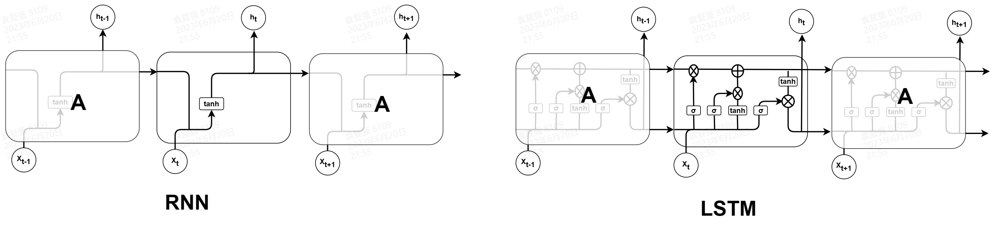

1.前言

&emsp;&emsp;Transformer以及其采用的自注意力机制率先再NLP领域取得成功，替代了处理序列数据常用的循环神经网络(RNN)。之后，自注意力机制很快也被推广
到视觉领域，并同样展现出强大的潜力。图像虽说本身不是时序数据，但其实可以看作是空间上的序列，而视频本身就是时序数据。因此，从理论上来说，**自注意力
可以用来处理图像数据和视频数据**。` `
&emsp;&emsp;与卷积网络在视觉领域的应用类似，自注意力也是从图像分类任务开始的，而ViT就是这个方向的开创性工作之一。之后，DETR成功将自注意力运行
到目标检测任务中。计算机视觉的子任务有很多，除了图像分类、目标检测还有语义分割、深度估计、3d重建等。研究自注意力在每个子任务上的适应性是有意义的，
但是一个更值得研究的方向是采用自注意力来提取适用于多种任务的通用视觉特征。这其实与CNN采用大规模的数据集预训练一个通用的Backbone网络，然后针对不同的
任务再用特定的数据集进行微调是类似的。Swin-Transformer和Plain Vision Transformer就是这个方向的两个代表作。` `

# 2.来自NLP领域的Transformer

&emsp;&emsp;**Transformer**和自注意力机制一开始是应用于NLP领域用来处理序列数据。在Transformer之前，处理自然语言序列数据的任务主要是由RNN及其变种完成的。如下图所示，
**RNN** 的结构非常简单，其核心思想是将前一时刻的状态 **$h_{t-1}$** (或者说记忆)与当前时刻的输入 **$X_{t}$** 合并到一起，以此来生成当前时刻的状态 **$h_{t}$** ，并按照这种模式顺序处理序列中的所以的数据。由于网络的参数在训练阶段就固定下来，RNN的这种结构不可避免的会导致历史信息的作用会 越来越弱，也就是无法保持长久的记忆。此外，RNN的训练还会受到梯度消失和梯度爆炸问题的影响。**长短期记忆网络(LSTM)** 在RNN的基础上增加了输入门、输出门、遗忘门三个控制门。处理训练阶段 固定的参数，这些门也受到当前数据的影响，可以动态的控制需要记住和遗忘什么信息，比例是多少。通过这种动态门控制，LSTM可以更好的保持长期记忆，因此可以处理更长的序列。` `

&emsp;&emsp;相比于RNN，LSTM可以更好的处理长时依赖关系，也就是说可以提取长时依赖关系。但是不管是RNN还是LSTM均采用顺序处理方式，这种方式一方面限制了并行能力，另一方面还是会丢失信息，
对于特别长的相关性尤其是全局相关性(指整个时间序列)还是无能为力。在这个背景下，Google的研究人员2017年在“Attention is all you need”论文中提出了基于自注意力机制的Transfomer模型，打破了顺序处理的限制，
把相关性提取的范围扩展到了全局维度，在很多NLP任务上都取得了非常显著的性能提升，也因此开启了业界研究注意力机制的热潮。
