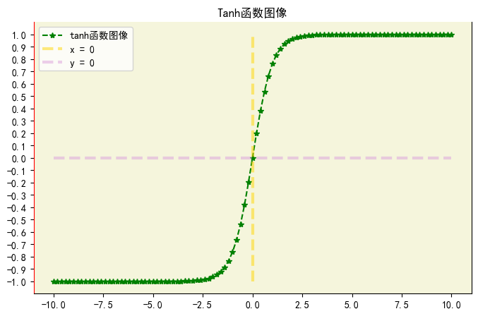
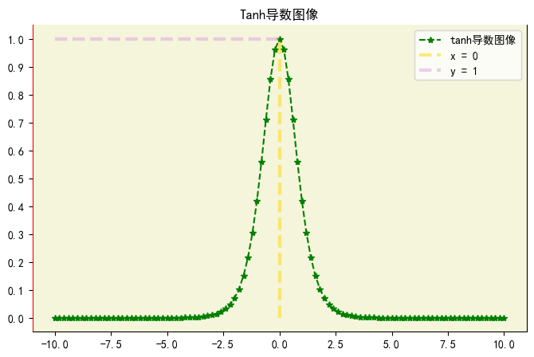
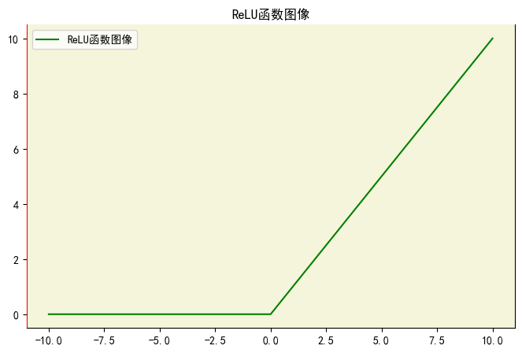
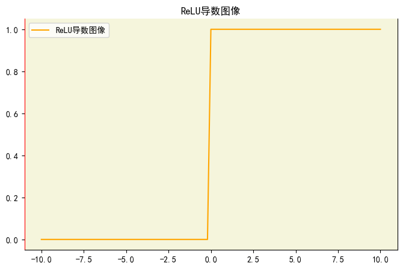
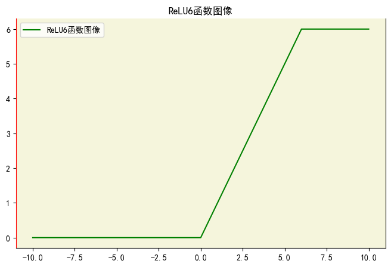

# 1.激活函数

## 1.1 什么是激活函数

### 1.1.1 定义和作用

&emsp;&emsp;**激活函数是一种用于神经网络和其他机器学习模型中的非线性函数**。它被应用于神经网络的每个神经元上，将输入信号进行转换，产生输出信号。
**激活函数的作用是引入非线性， 使神经网络能学习和表示更复杂的函数关系。**
` ` ` `
**激活函数的作用主要有以下几点：**

* **引入非线性：** 激活函数能够将线性变换的输入转换为非线性输出，使得神经网络具备非线性建模能力。这对于解决复杂的非线性问题至关重要。
  ` `
* **改善模型的表达能力：** 通过引入非线性，激活函数能够增加神经网络的表达能力，使其能够学习和表示更复杂的非线性关系。
  ` `
* **增强网络的稳定性:** 激活函数能够限制神经元的输出的范围，防止信号的过度扩散和衰减，从而增强网络的稳定性和收敛性。

### 1.1.2 常见的激活函数

- Sigmoid函数(Logistic 函数)
- 双曲正切函数(Tanh 函数)
- ReLU函数(修正线性单元)
- Leaky ReLU函数
- Parametric ReLU函数(PReLU)
- ELU函数(指数线性单元)
- Softmax函数(用于多分类任务)

## 1.2 激活函数详解

在神经网络中，希望当前一层的神经元输出均值为0，为什么均值为0呢？有以下几点原因:

* **均值中心化：** 将激活函数的期望值设置为0可以使得网络的输出更容易进行归一化处理。通过均值归一化，可以减少输入数据的偏移和不平衡，有助于提高网络的稳定性和收敛速度。
  ` `
* **梯度传播：** 激活函数的期望为0可以促使梯度在反向传播中跟好的传播。当激活函数的期望为非零时，梯度的平均值可能会发生偏移，导致梯度在传播过程中不稳定。而期望为0的激活函数可以使得梯度在不同层之间的传播更加一致和稳定。
  ` `
* **防止梯度爆炸和梯度消失：** 激活函数的期望为0有助于缓解梯度消失和梯度爆炸的问题。如果激活函数的期望值较大，网络的参数更新可能会导致梯度变得非常大，造成梯度爆炸。相反，如果激活函数的期望值较小，梯度可能在反向传播中逐渐消失，导致梯度消失的问题。通过将激活函数的期望设置为0，可以在一定程度上避免这些问题。

### 1.2.1 Sigmoid函数

$$
\sigma(x) = \frac{1}{1 + e^{-x}} = \frac{e^x}{1 + e^x}

$$

$$
\sigma^`(x) = \sigma(x)[1 - \sigma(x)]

$$

**Sigmoid函数的特点为：**

* **输出范围:** Sigmoid函数的输出范围在0到1之间，**可以将输出解释为概率值，表示某个事件发生的概率。**
  ` `
* **平滑性：** Sigmoid函数具有平滑的连续性质，其曲线在整个定义域内是光滑且单调递增的。方便求导，能求导久能用  梯度下降法来优化。
  ` `
* **中心对称性：** Sigmoid函数关于y = 0.5对称，即对任意的x,有f(-x) = 1 - f(x)
  ` `
* **饱和性：** 当输入值非常大或者非常小时，Sigmoid函数的输出接近于1或0，导致梯度接近于0。这种饱和性会在神经网络训练过程中出现梯度消失的问题。如果激活函数的期望值过大，网络的参数更新会导致梯度变得非常大，造成梯度爆炸。相反如果激活函数的期望值较小，梯度可能在反向传播过程中逐渐消失，导致梯度消失的问题。通过将激活函数的期望设置为0，可以在一定程度上避免这个问题。

  

 

  

### 1.2.2 tanh函数

tanh函数可以解决Sigmoid函数期望不为0的情况，函数的输出范围为(-1, 1),但**tanh函数依然存在梯度消失的问题。** 公式如下:

$$
tanh(x) = \frac{e^x - e^{-x}}{e^x + e^{-x}}

$$

$$
tanh^`(x) = 1 - [tanh(x)]^2

$$

**tanh函数的特点如下：**

* **输出范围：** tanh函数输出范围在-1和1之间，可以将输出解释为样本属于不同类别的置信度和概率。
* **平滑性：** tanh函数具有平滑的连续性质，其曲线在整个定义域区间都是光滑且单调递增的。
* **中心对称性:** tanh函数关于原点中心对称，即对任意的x，有f(-x) = f(x)。输出的期望为0.
* **饱和性：** 当输入的值非常大或者非常小时，tanh函数的输出为1或-1，导致梯度接近于0。这种饱和的性质容易出现梯度消失的问题。

  

 

  

### 1.2.3 ReLU函数

ReLU函数可以有效避免梯度消失的问题。公式如下：

$$
ReLU(x) = \begin{cases}
x & x \geq 0 \\
0 & x < 0
\end{cases}

$$

ReLU函数的特点如下：

* **线性性质：** 在输入为正时，ReLU函数是线性函数，直接将输入值传递给输出。这使得ReLU函数具有较强的表达能力。
* **非线性性质：** 在输入为负时，ReLU函数的输入为0，引入了非线性，可以帮助神经网络学习更复杂的模式和表示。
* **稀疏激活：** ReLU函数的输出为0的特性使得神经网络的神经元具有稀疏激活性。对于给定的输入样本，只有部分神经元会被激活，从而减少了参数的冗余性，提高了网络的效率。
* **梯度消失问题的缓解：** 相比于Sigmoid和Tanh函数，在反向传播过程中，ReLU函数的梯度计算简单且不会出现饱和现象，因此更不容易出现梯度消失的问题。
* **死区现象：** ReLU函数在输入为负时输出为0，可能导致神经元死亡问题，即一旦激活为0，对应的权重不再更新，该神经元很可能包含重要特征。
* **梯度爆炸：** ReLU不会对数据做幅度压缩，如果数据的幅度不断扩张，模型层数越深，幅度扩张越厉害，出现梯度爆炸，最终会影响模型性能。

  

 

  

ReLU函数梯度稳定，值比Sigmoid大，所以**可以加快网络训练**。不过ReLU的缺点就是小于0的值不再得到响应，这不利于网络训练。**归一化时，要做Min-Max归一化，而不是Z-score归一化。**

### 1.2.4 ReLU6函数

ReLU6是对ReLU的数据做幅度压缩，所以将ReLU的最大值设置为6

  

### 1.2.5 Leaky ReLU函数

Leaky ReLU函数为ReLU负值增加了一个斜率,缓解了“死区现象”, 公式如下：

$$
Leaky ReLU(x) = \begin{cases}
x & x \geq 0 \\
\alpha*x & x < 0
\end{cases}

$$

$\alpha$ 是一个小的正数，通常取接近于0的值，如0.01。

  

可以看到，x=0的左边存在斜率，那么负值也可以得到响应，有利于网络学习到更多的信息。**Leaky ReLU函数的缺点是，超参数$\alpha$的取值不好确定。当我们想让神经网络学到负值信息时，可以使用该激活函数。

Leaky ReLU函数的特点如下：

* **线性性质：** 当输入为正时，Leaky ReLU函数和ReLU函数一样，直接输出输入值，具有线性性质。
* **非线性性质：** 在输入为负时，Leaky ReLU函数乘以一个斜率$\alpha$,引入了非线性，可以帮助神经网络学习更复杂的模式和表示。
* **缓解神经元死亡问题：** 通过引入一个很小的斜率$\alpha$,Leaky ReLU函数使得负值不再完全变为0，从而缓解了神经元死亡的问题。即使输入为负，梯度仍然可以传播更新相关权重。
* **零中心性：** 当斜率$\alpha$取较小的正数时，Leaky ReLU函数在整个定义域上保持零中心性，有助于网络的稳定性和收敛性。

## 1.2 激活函数相关面试题

### 1.2.1 说说你了解的激活函数，分别应用于什么场景？

1. **Sigmoid**。公式如下：

   $$
   \sigma(x) = \frac{1}{1 + e^{-x}}

   $$

   Sigmoid函数是第一个被**广泛应用于神经网络**的激活函数。经过Sigmoid函数作用后，输出值的范围在(0, 1), 但是其输出存在均值不为0的情况，并且存在梯度消失的问题，在深层网络中被其他激活函数取代。在逻辑回归中用改激活函数输出概率。
2. **Tanh**。公式如下：

   $$
   tanh(x) = \frac{e^x - e^{-x}}{e^x + e^{-x}}

   $$

   tanh函数可以解决Sigmoid函数输出均值不为0的情况，输出范围为(-1, 1)，但还是会存在**梯度消失的问题。**
3. **ReLU**。ReLU激活函数可以**有效避免梯度消失的问题**，公式如下：

   $$
   ReLU(x) = \begin{cases}
   x & x \geq 0 \\
   0 & x < 0
   \end{cases}

   $$

   ReLU函数的缺点是**负值成为“死区”**，神经网络无法再对其进行响应。Alex-Net使用了ReLU函数。**当我们训练深层神经网络时最好使用ReLU函数而不是Sigmoid函数。**
4. **Leaky ReLU**。Leaky ReLU函数为ReLU函数的负值增加了一个斜率，缓解了死区现象。公式如下：

   $$
   Leaky ReLU(x) = \begin{cases}
   x & x \geq 0\\
   \alpha * x & x < 0
   \end{cases}

   $$

   Leaky ReLU函数的缺点是，**超参数$\alpha$的值不好确定**。当想让神经网络能学到负值的信息，那么使用该激活函数。
5. **Mish激活函数**。Mish激活函数同样允许负值有一定的梯度。公式如下：

   $$
   Mish(x) = xtanh(log(1 + e^{x}))

   $$

   应用场景同Leaky ReLU函数。
6. **参数化ReLU(P-ReLU)**。参数化ReLU为了解决超参数$\alpha$合适的值不好设定的问题，干脆将这个参数也融入到模型的训练中，也使用误差反向传播和梯度下降法来更新参数。
7. **随机化ReLU(R-ReLU)**。顾名思义，就是**将超参数$\alpha$随机化，让不同的层自己学习不同的超参数**，但随机化的超参数的分布符合均匀分布或高斯分布。
8. **指数化线性单元(ELU)**。也是为了解决死区问题。公式如下:

   $$
   ELU(X) = \begin{cases}
   x & x \geq 0 \\
   \lambda * (e^x - 1)  & x < 0
   \end{cases}

   $$

   缺点是指数运算量大。
9. Maxout。与常规激活函数不同，**Maxout是一个可以学习的分段线性函数。** 其原理是，任何ReLU及其变体都可以看成分段的线性函数，而Maxout加入的一层神经元正是可以学习参数的分段线性函数。
   **优点是：** 其拟合能力很强，理论上可以拟合任意凸函数。缺点是参数量激增。在Network-in-Network中使用的该激活函数。
10. Softmax函数是一种常用的激活函数，常用于多分类任务，softmax将输入向量转化为一个概率分布，使得各个类别的输出概率为1。**Softmax不用于神经网络的中间层，而是在最后输出时使用。** 公式如下：

    $$
    softmax(x) = \frac{e^{z_{i}}}{\sum_{k=0}^Ke^{z_{k}}},i=1,2,...K

    $$
11. SoftPlus相当于是ReLU函数的平滑，解决了Deed ReLU问题。公式如下：

    $$
    SoftPlus(x) = log(1 + e^x)

    $$

### 1.2.2 Sigmoid有什么缺点，有哪些解决方法？

Sigmoid是第一个被广泛于神经网络的激活函数。经过Sigmoid函数处理后，输出范围在(0, 1)之间。但是Sigmoid函数的输出存在均值不为0的情况，并且存在梯度消失和梯度爆炸的问题。

**解决方法：**

* 在深层网络中用其他激活函数代替。如ReLU、Leaky ReLU等。
* 在分类问题中，用Sigmoid函数做激活函数时，使用交叉熵损失代替均方误差损失。
* 采用正确的权重初始化方法，如He_init方法。
* 加入BN层
* 分层训练权重

### 1.2.3 Softmax溢出怎么处理？

为了处理Softmax溢出问题，可以用以下方法处理：

* **常数平移：** 对输入向量中的元素每一个减去该向量的最大值。这样做可以确保指数输入的值不会过大，减少数值溢出的风险。

### 1.2.4 为什么需要使用非线性激活函数而不是线性激活函数

1. **非线性模型能力：** 神经网络的目标是学习非线性关系和复杂模式。如果使用线性激活函数，多个线性层的组合仍然只会产生一个线性函数，无法学习的复杂的非线性关系。
2. **解决异或问题：** 异或是经典的非线性问题。用线性函数无法精确拟合异或函数。通过引入非线性激活函数，如ReLU, Tanh等，可以实现神经网络对异或问题的学习。
3. **激活函数的导数：** 非线性激活函数具有非0的导数，这对于反向传播和梯度下降非常重要。线性激活函数的导数往往是一个常数，不具备区分不同输入值的能力，这会导致反向传播梯度无法传递有用的信息，从而影响网络的学习能力。
4. **增加非线性信息：** 通过引入非线性激活函数，神经网络可以引入更多的非线性特性。这有助于模型学习更复杂的模式，表达更丰富的特征，并提高模型的泛化能力。

### 1.2.5 在训练神经网络时，选择激活函数有什么考虑因素？

1. **非线性性：** 激活函数应该是非线性的，以便神经网络可以学习和表示复杂的非线性性质。线性激活函数只能实现线性模型，无法捕捉非线性模式。
2. **梯度消失和爆炸：** 某些激活函数可能导致梯度消失和梯度爆炸的问题。梯度消失指的是在反向传播过程中，梯度逐渐变小，导致较远层的权重更新缓慢。梯度爆炸则是梯度变得非常大，导致数值不稳定和训练困难。选择激活函数时，应该考虑其梯度的稳定性。避免梯度消失和爆炸的问题，特别时很深的神经网络。
3. **可微性：** 激活函数应该时可微的，以便能够进行反向传播和梯度计算。可微性是计算神经网络的关键要求，因为梯度下降法依赖于梯度计算来更新权重。
4. **计算效率：** 某些激活函数可能计算复杂度较高，导致网络训练速度变慢。在实际应用中，应考虑激活函数的计算效率，特别是在大型神经网络和大规模数据集上训练的时候。
5. **具体任务需求：** 不用的任务对激活函数的需求不一样。例如：对于二分类任务，Sigmoid函数常被用来做输出层的激活函数，Softmax函数用于多分类任务最后一层的激活函数。而在图片分类中，ReLU函数常被用做隐藏层的激活函数。

### 1.2.6 在NLP任务中，常有的激活函数有哪些？

* **Tanh激活函数：** Tanh函数的输出范围为(-1, 1),对于文本分类和情感分析任务非常常见。Tanh函数具有对称性和可导性，能够保证输入的正负性和非线性关系。
* **Sigmoid函数：** Sigmoid函数将输入值映射到（0， 1）范围内，常用于二分类和概率估计。在 NLP 任务中，它经常用于情感分析、命名实体识别等任务中作为输出层的激活函数，将输出转化为概率。
* **Softmax函数：** Softmax 函数主要用于多类别分类问题，将多个输出值归一化为概率分布。在NLP任务中，例如文本分类和机器翻译中，Softmax 函数常用于输出层的激活函数，将网络的输出转化为各个类别的概率。
