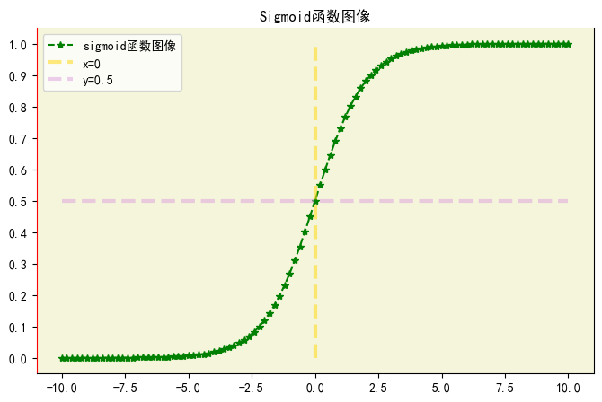
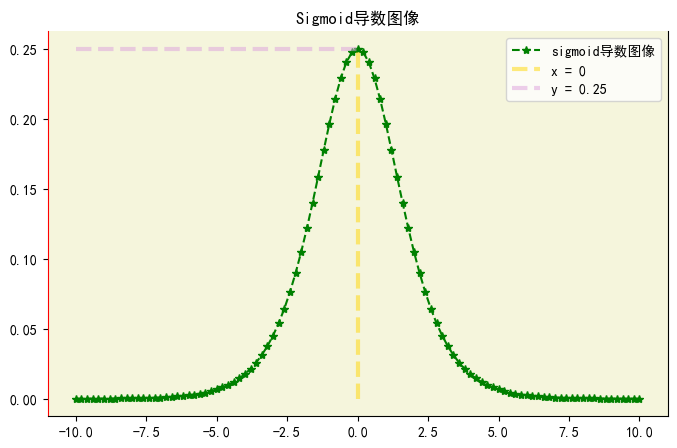

# 1.激活函数

## 1.1 什么是激活函数

### 1.1.1 定义和作用

&emsp;&emsp;**激活函数是一种用于神经网络和其他机器学习模型中的非线性函数**。它被应用于神经网络的每个神经元上，将输入信号进行转换，产生输出信号。
**激活函数的作用是引入非线性， 使神经网络能学习和表示更复杂的函数关系。**
   
**激活函数的作用主要有以下几点：**

* **引入非线性：** 激活函数能够将线性变换的输入转换为非线性输出，使得神经网络具备非线性建模能力。这对于解决复杂的非线性问题至关重要。
   
* **改善模型的表达能力：** 通过引入非线性，激活函数能够增加神经网络的表达能力，使其能够学习和表示更复杂的非线性关系。
   
* **增强网络的稳定性:** 激活函数能够限制神经元的输出的范围，防止信号的过度扩散和衰减，从而增强网络的稳定性和收敛性。

### 1.1.2 常见的激活函数

- Sigmoid函数(Logistic 函数)
- 双曲正切函数(Tanh 函数)
- ReLU函数(修正线性单元)
- Leaky ReLU函数
- Parametric ReLU函数(PReLU)
- ELU函数(指数线性单元)
- Softmax函数(用于多分类任务)

## 1.2 激活函数详解

在神经网络中，希望当前一层的神经元输出均值为0，为什么均值为0呢？有以下几点原因:

* **均值中心化：** 将激活函数的期望值设置为0可以使得网络的输出更容易进行归一化处理。通过均值归一化，可以减少输入数据的偏移和不平衡，有助于提高网络的稳定性和收敛速度。
   
* **梯度传播：** 激活函数的期望为0可以促使梯度在反向传播中跟好的传播。当激活函数的期望为非零时，梯度的平均值可能会发生偏移，导致梯度在传播过程中不稳定。而期望为0的激活函数可以使得梯度在不同层之间的传播更加一致和稳定。
   
* **防止梯度爆炸和梯度消失：** 激活函数的期望为0有助于缓解梯度消失和梯度爆炸的问题。如果激活函数的期望值较大，网络的参数更新可能会导致梯度变得非常大，造成梯度爆炸。相反，如果激活函数的期望值较小，梯度可能在反向传播中逐渐消失，导致梯度消失的问题。通过将激活函数的期望设置为0，可以在一定程度上避免这些问题。

### 1.2.1 Sigmoid函数

$$
\sigma(x) = \frac{1}{1 + e^{-x}} = \frac{e^x}{1 + e^x}

$$

$$
\sigma^`(x) = \sigma(x)[1 - \sigma(x)]

$$

**Sigmoid函数的特点为：**

* **输出范围:** Sigmoid函数的输出范围在0到1之间，**可以将输出解释为概率值，表示某个事件发生的概率。**
   
* **平滑性：** Sigmoid函数具有平滑的连续性质，其曲线在整个定义域内是光滑且单调递增的。方便求导，能求导久能用  梯度下降法来优化。
   
* **中心对称性：** Sigmoid函数关于y = 0.5对称，即对任意的x,有f(-x) = 1 - f(x)
   
* **饱和性：** 当输入值非常大或者非常小时，Sigmoid函数的输出接近于1或0，导致梯度接近于0。这种饱和性会在神经网络训练过程中出现梯度消失的问题。如果激活函数的期望值过大，网络的参数更新会导致梯度变得非常大，造成梯度爆炸。相反如果激活函数的期望值较小，梯度可能在反向传播过程中逐渐消失，导致梯度消失的问题。通过将激活函数的期望设置为0，可以在一定程度上避免这个问题。

  

 

  

